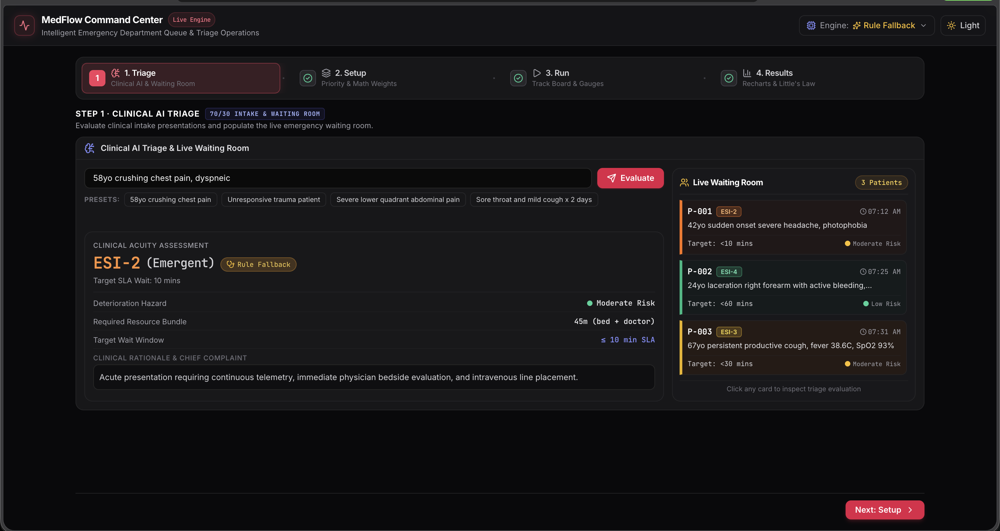
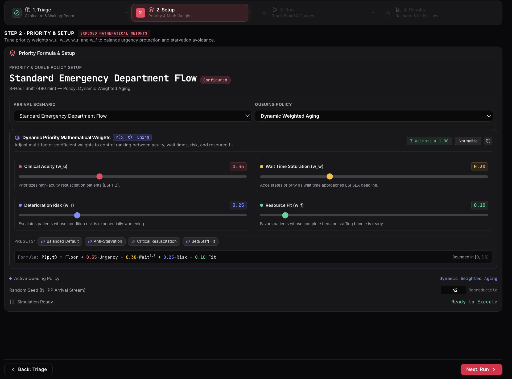
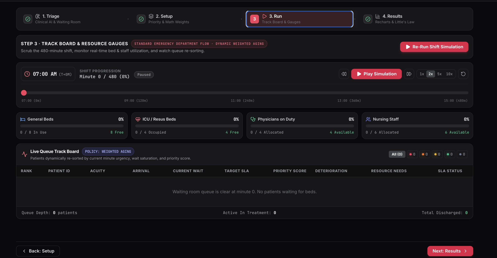
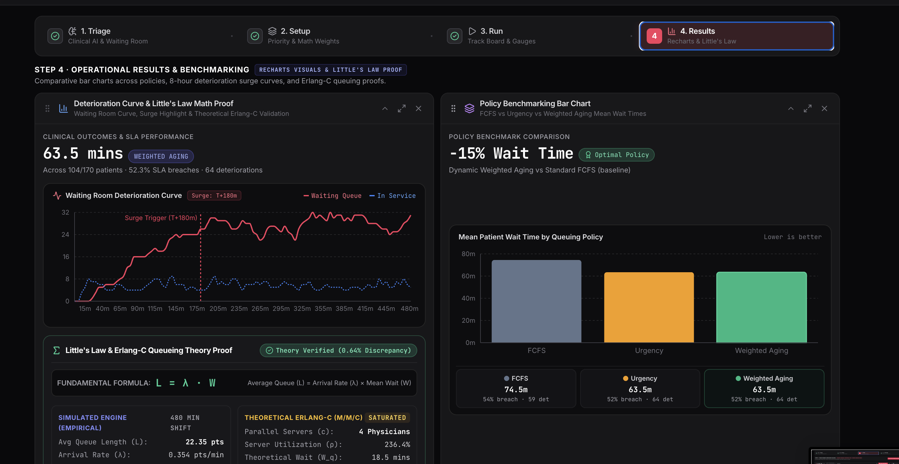

# MedFlow — Intelligent Emergency Department Queue & Triage Platform

**A simulation that decides who an emergency room should treat next — safely, fairly, and with an AI assistant reading the intake notes.**

Built for **Hack-a-Matics** (Pentagram, Mathematical Society of BMSCE, with BMSCE IEEE Computer Society).

<!-- TODO: paste your deployed website link on the line below once it's live -->
🔗 **Live Demo:** [ADD YOUR LIVE LINK HERE]

<!-- TODO: once you have a real license file, keep this line as-is; it already points to LICENSE -->
📄 **License:** [MIT](./LICENSE)

---

## What is this, in simple words

Think of a busy government hospital's emergency ward on a Saturday night.
Twenty people are sitting in the waiting area. A person with a minor cut
came in first. A person having chest pain came in five minutes later. If
the hospital just called people in the order they arrived — like a ration
shop queue — the chest pain patient would be sitting and waiting while a
minor cut gets treated first. That is obviously not okay.

**MedFlow is a working simulation of a smarter system.** It:

- Reads a nurse's rough note about a patient (typed in plain English) and
  uses an AI model to figure out how serious it is.
- Keeps track of a fake but realistic stream of patients arriving all
  through a shift, some calm periods, some sudden rushes (like a mass
  accident).
- Decides who gets treated next using different possible "house rules,"
  and always keeps one rule fixed no matter what: **someone in real
  danger can never be pushed back just because someone else waited
  longer.**
- Shows, with real numbers, which house rule actually keeps people safest
  and reduces waiting the most — by testing every rule on the exact same
  group of patients, so the comparison is fair.

It is not a real hospital system, obviously — it's a hackathon project
that shows how such a system *could* work, and proves the underlying idea
is mathematically sound, not just a nice-looking screen.

---

## Screenshots

<!--
TODO: add your actual screenshot image files here.
1. Create a folder in your repo called "screenshots"
2. Save your app screenshots inside it, named exactly like below
3. The images will then show up automatically wherever you see them
   referenced in this file — no other change needed.
-->

### Step 1 — AI Triage & Live Waiting Room
A nurse's note goes in, an AI-generated severity rating comes out, and the
waiting room fills up with patients you can actually see and understand —
not just numbers.



### Step 2 — Setup: Choosing the Situation and the House Rule
Pick how busy the shift is (a calm day, or a sudden crisis), and which
house rule decides who gets seen next.



### Step 3 — Watching the Shift Play Out
The whole shift runs minute by minute — beds filling up, staff getting
busy, and the waiting room re-sorting itself in real time as the rule
picks who goes next.



### Step 4 — Results and Fair Comparison
The same patients are run through every house rule, back to back, so you
can see — honestly, not just claimed — which one actually performs
better.



---

## Why this matters (the real-world problem)

Real emergency rooms already use a severity-check system, but doing it
well — balancing "who is sickest" against "who has waited longest" against
"do we even have a free bed for them" — is genuinely hard to get right by
gut feeling alone. Get it wrong, and people who could have been saved end
up waiting too long. MedFlow shows this decision as a working, testable
system instead of a guess, and proves — with actual runs, not opinions —
that a smarter rule beats a plain first-come-first-served line.

---

## Main Features

- **AI-Powered Triage** — type a patient's condition in plain English, and
  an AI model reads it and gives a proper severity rating, what they'll
  likely need (a bed, a doctor), and how risky it is to make them wait.
- **Honest Fallback System** — if the AI can't be reached for any reason,
  the app doesn't hide the problem. It switches to a simple backup
  checklist and clearly labels the result as a fallback, so you always
  know whether a real AI answered or a backup rule did.
- **Multiple Waiting-Room Rules** — compare four different approaches to
  deciding who's treated next, from the simplest ("first come, first
  served") to a smarter one that balances urgency, waiting time, and
  worsening risk together.
- **A Safety Rule That Never Breaks** — no matter what, a genuinely
  critical patient can never be pushed behind someone who simply arrived
  earlier. This is built in permanently, not something you can turn off.
- **Realistic Simulated Shifts** — patients arrive at random but realistic
  times, including sudden-crisis scenarios (like a mass accident), so the
  system gets tested under real pressure, not just a calm day.
- **Live Resource Tracking** — beds, ICU beds, doctors, and nurses are all
  limited, and the app shows exactly how full each one is as the shift
  plays out.
- **Fair Side-by-Side Comparison** — every house rule is tested on the
  *exact same* group of patients, arriving at the exact same times, so
  the comparison between rules is genuinely fair and not a coincidence.

---

## How It Works — Step by Step

1. **Triage** — a patient's condition is described in plain text, and the
   AI (or, if unavailable, a backup checklist) rates how urgent it is.
2. **Setup** — you choose how busy the shift is and which house rule
   decides treatment order.
3. **Run** — the whole shift plays out automatically, patient by patient,
   minute by minute, and you can watch beds and staff fill up and the
   queue re-sort itself.
4. **Results** — you see real numbers: average waiting time, how many
   people were treated late, and a fair side-by-side comparison of every
   house rule tested on the same patients.

---

## Tech Stack

| Part | What we used |
|---|---|
| Backend | Python, FastAPI |
| AI / Triage | Groq API |
| Frontend | React, TypeScript, Vite |
| Styling | Tailwind CSS, shadcn/ui |
| Charts | Recharts |

---

## Running It Yourself

```bash
# Backend
cd backend
python -m venv .venv
source .venv/bin/activate      # Windows: .venv\Scripts\activate
pip install -r requirements.txt
# add your own GROQ_API_KEY in a .env file inside backend/ before this step
uvicorn app.main:app --reload --port 8000

# Frontend (in a separate terminal)
cd frontend
npm install
npm run dev
```

Then open the frontend's address in your browser. A Groq API key is free
and takes two minutes to get at console.groq.com — the app runs fine even
without one, but will honestly tell you it's using its backup rules
instead of real AI until you add a key.

---

## About the AI Component

MedFlow's triage assistant uses the **Groq API** to read a free-text
patient description and turn it into a structured severity rating. If
Groq is unreachable for any reason, the app automatically and visibly
switches to a simple keyword-based backup instead of pretending the AI
answered — this is a deliberate, permanent design choice, not a bug.

---

## Known Limitations

Being upfront about what this project does *not* do, since that matters
more than pretending it's perfect:

- Hospital resources (beds, doctors) are treated as identical/interchangeable
  within their category — a real hospital has more nuance than that.
- Patients are assigned resources one at a time, in priority order — this
  is simple and fast, but not always the mathematically "best possible"
  way to assign an entire waiting room at once.
- The mathematical comparisons used to sanity-check the simulation assume
  a simplified model of how patients move through the system.

---

## Roadmap / Ideas for Later

- A more advanced resource-assignment method that looks at the whole
  waiting room at once, instead of one patient at a time.
- Testing each house rule across many random days instead of just one, to
  show the results hold up consistently.
- Routing patients across multiple hospital departments, not just one ER.

---

## License

This project is licensed under the MIT License — see the [LICENSE](./LICENSE)
file for details. In short: you're free to use, copy, modify, and share
this project, as long as the original license notice stays with it.

---

## Acknowledgements

Built for **Hack-a-Matics**, organised by Pentagram (Mathematical Society
of BMSCE) with BMSCE IEEE Computer Society.
